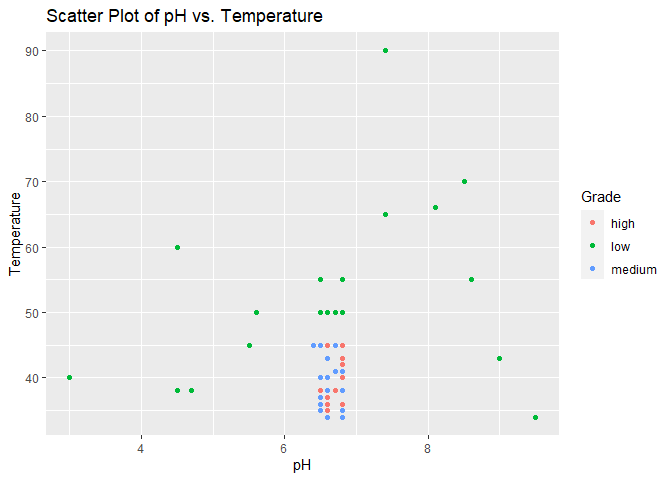
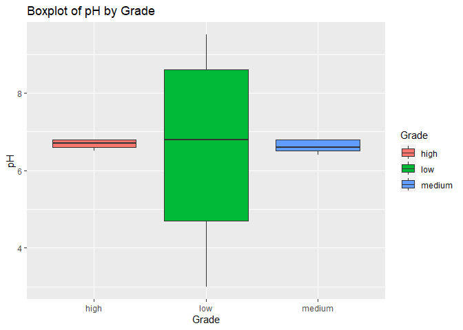

## R Markdown

This is an R Markdown document. Markdown is a simple formatting syntax
for authoring HTML, PDF, and MS Word documents. For more details on
using R Markdown see <http://rmarkdown.rstudio.com>.

When you click the **Knit** button a document will be generated that
includes both content as well as the output of any embedded R code
chunks within the document. You can embed an R code chunk like this:
Issue 1

    #loading of library
    library(readr)
    library(dplyr)

    ## 
    ## Attaching package: 'dplyr'

    ## The following objects are masked from 'package:stats':
    ## 
    ##     filter, lag

    ## The following objects are masked from 'package:base':
    ## 
    ##     intersect, setdiff, setequal, union

    library(ggplot2)
    library(caret)

    ## Loading required package: lattice

    library(glmnet)

    ## Loading required package: Matrix

    ## Loaded glmnet 4.1-8

    # Load data from a CSV file
    data <- read.csv("C:/Users/Kaguash/Downloads/Milk/data/milknew.csv")

Issue 2

    # Frequency table of Grades
    grade_frequency <- table(data$Grade)
    print(grade_frequency)

    ## 
    ##   high    low medium 
    ##    256    429    374

    # Mean
    mean_temperature <- mean(data$Temprature)

    # Median
    median_temperature <- median(data$Temprature)

    # Calculate the mode of temperature for each group
    mode_temperature_by_group <- data %>%
      group_by(Grade) %>%
      summarize(mode_temperature = mode(Temprature))

    # Display the results
    print(paste("Mean Temperature:", mean_temperature))

    ## [1] "Mean Temperature: 44.2266288951841"

    print(paste("Median Temperature:", median_temperature))

    ## [1] "Median Temperature: 41"

    print(paste("Mode Temperature:", mode_temperature_by_group))

    ## [1] "Mode Temperature: c(\"high\", \"low\", \"medium\")"        
    ## [2] "Mode Temperature: c(\"numeric\", \"numeric\", \"numeric\")"

    # Measures of Distribution:
    pH_range <- range(data$pH)

    # Variance
    pH_variance <- var(data$pH)

    # Display the results
    print(paste("pH Range:", paste(pH_range, collapse = " - ")))

    ## [1] "pH Range: 3 - 9.5"

    print(paste("Variance of pH:", pH_variance))

    ## [1] "Variance of pH: 1.95910121364986"

    # Measures of Relationship:
    # Correlation coefficient
    correlation_coefficient <- cor(data$pH, data$Temprature)

    # Display the correlation coefficient
    print(paste("Correlation Coefficient between pH and Temperature:", correlation_coefficient))

    ## [1] "Correlation Coefficient between pH and Temperature: 0.244684058847391"

Issue 3

    # Perform ANOVA on Grade based on pH
    #anova_result <- aov(Grade ~ pH, data = data)

    # Summary of ANOVA results
    #summary(anova_result)

Issue 4

    ## [1] FALSE

Issue 5

    #Data Splitting

    # Splitting data into training (70%) and testing (30%) sets
    set.seed(123)
    trainIndex <- createDataPartition(data$Grade, p = 0.7, list = FALSE)
    training_set <- data[trainIndex, ]
    testing_set <- data[-trainIndex, ]

    #Cross validation
    # Define the training control
    train_control <- trainControl(method = "cv", number = 10)

    sum(is.na(training_set$Grade))

    ## [1] 0

    training_set$Grade <- as.factor(training_set$Grade)

    #Model training Random Forest
    # Train a Random Forest model
    library(randomForest)

    ## randomForest 4.7-1.1

    ## Type rfNews() to see new features/changes/bug fixes.

    ## 
    ## Attaching package: 'randomForest'

    ## The following object is masked from 'package:ggplot2':
    ## 
    ##     margin

    ## The following object is masked from 'package:dplyr':
    ## 
    ##     combine

    rf_model <- train(Grade ~ ., data = training_set, method = "rf", trControl = train_control)

    # Make predictions on the testing set
    predictions <- predict(rf_model, newdata = testing_set)

Issue 6

    # Train an SVM model
    library(e1071)
    svm_model <- train(Grade ~ ., data = training_set, method = "svmRadial", trControl = train_control)

    #Model sampling and comparison
    # Define the control parameters for resampling
    train_control <- trainControl(method = "cv", number = 10)  # 10-fold cross-validation

    # List of trained models
    models_list <- list(
      Random_Forest = rf_model,
      SVM = svm_model
    )

    # Compare model performance using resampling techniques
    results <- resamples(models_list, control = train_control)

    # Summarize and compare model performance metrics (e.g., accuracy, sensitivity, specificity)
    summary(results)

    ## 
    ## Call:
    ## summary.resamples(object = results)
    ## 
    ## Models: Random_Forest, SVM 
    ## Number of resamples: 10 
    ## 
    ## Accuracy 
    ##                    Min.   1st Qu.    Median      Mean  3rd Qu.      Max. NA's
    ## Random_Forest 1.0000000 1.0000000 1.0000000 1.0000000 1.000000 1.0000000    0
    ## SVM           0.9054054 0.9326577 0.9463063 0.9488288 0.972973 0.9866667    0
    ## 
    ## Kappa 
    ##                    Min.   1st Qu.    Median      Mean   3rd Qu.      Max. NA's
    ## Random_Forest 1.0000000 1.0000000 1.0000000 1.0000000 1.0000000 1.0000000    0
    ## SVM           0.8567478 0.8979131 0.9179351 0.9222055 0.9587973 0.9796251    0

Issue 7

    # Using bagging for Random Forest
    library(caret)

    bagged_rf <- train(
      Grade ~ .,
      data = training_set,
      method = "rf",
      trControl = trainControl(method = "boot", number = 10),  # Using bootstrapping for bagging
      #bagControl = bagControl(method = "boot", number = 10)  # Number of bags
    )

Note that the `echo = FALSE` parameter was added to the code chunk to
prevent printing of the R code that generated the plot.
